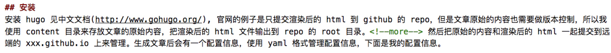

---
title: "hugo 使用"
date: 2019-01-17T11:43:30+08:00
tags: [ "hugo" ]
categories: [ "others" ]
comments: true
---

## 安装
安装 hugo 见中文文档(http://www.gohugo.org/), 官网的例子是只提交渲染后的 html 到 github 的 repo，但是文章原始的内容也需要做版本控制，所以我使用 content 目录来存放文章的原始内容，把渲染后的 html 文件输出到 repo 的 root 目录。<!--more--> 然后把原始的内容和渲染后的 html 一起提交到远端的 xxx.github.io 上来管理。生成文章后会有一个配置信息，使用 yaml 格式管理配置信息，下面是我的配置信息。


```yaml
BaseUrl: "https://zjj2wry.github.io/"
Title: "zhengjiajin's blog"
theme: "beg" # hugo 的主题，选择它的原因是比较简洁，但是提供了 categories 和 tags 的功能
disqusShortname: zhengjiajin # 评论系统，需要去 disqus 创建一个账号，不过需要翻墙

Params:
  Author: "zhengjiajin"
  Github: "zjj2wry"
  ShowRelatedPost: True
  # Disqus: "unresolved"

MetadataFormat: "yaml"
```
## 写博客
在博客的头部添加文章的 metadata 信息，然后内容使用 markdown 格式写就完事了。

```yaml
---
title: "hugo 使用"
date: 2019-01-17T11:43:30+08:00
tags: [ "hugo" ]
categories: [ "others" ]
comments: true # 是否开启评论
---
```
另外 hugo 默认会自动截取文章前面的一段内容作为摘要信息，可以使用 ```<!--more-->``` 手动指定摘要的内容



## 发布
写完了之后需要把写完的 blog 渲染成 html 文件，执行 ```hugo -d .```， -d 选择输出目录的位置，把它输出到当前 repo 的 root 的目录，然后 push
到 github repo 即可。

```
hugo -d .
```

本地预览执行命令
```
hugo server
```
