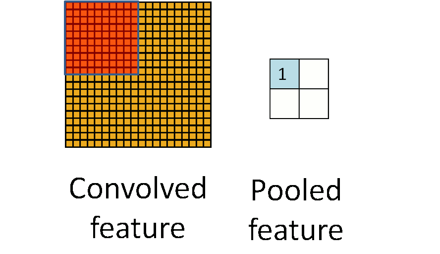

## 为什么要使用 cnn？

### 特征提取

cnn 和传统神经网络一样，也是自动提取特征，因为使用了局部感受野(local receptive fields)，cnn 可以表示出相邻的像素点之间的关系，距离较近的像素相关性要远大于距离较远像素的相关性。特征数目过少，我们可能无法精确的分类出来，即我们所说的欠拟合，如果特征数目过多，可能会导致我们在分类过程中过于注重某个特征导致分类错误，即过拟合。卷积层有相当大的先天的对于过度拟合的抵抗。原因是共享权重意味着卷积滤波器被强制从整个图像中学习。这使他们不太可能去选择在训练数据中的局部特质。

### 平移不变性

cnn 使用 filter 或者 kernel 卷积图像，比如一只猫出现在不同的位置上， 依然可以捕获到相同的特征。另外 cnn 使用了共享权值和偏重，相比于传统的神经网络大大减少了权重和参数的个数。

## pooling 层的作用

pooling 层会压缩矩阵，最大的作用是防止过拟合，提高模型泛化能力，图片平移动和旋转后具有不变性

